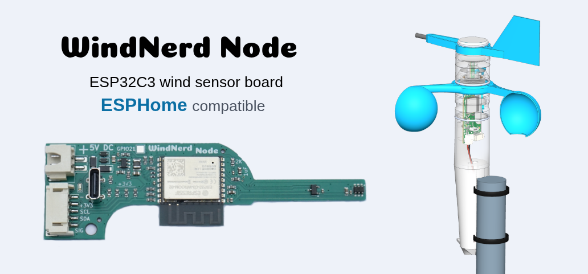

# WindNerd Node

WindNerd Node is an ESP32 wind sensor board for the [WindNerd 3D-printed anemometer](https://github.com/windnerd-labs/Anemometer-3D-files). It ships with **ESPHome** pre-installed, so it works out of the box with **Home Assistant**.

Besides wind speed and direction, an extension connector exposes an I²C bus for chaining extra sensors, plus a general-purpose I/O that can count the pulses of a tipping-bucket rain gauge.

Complete kits are available in the [WindNerd shop](https://windnerd.net/en/shop).

## Getting started

### Building

Print and assemble the anemometer head and its receptacle following the [documentation](https://windnerd.net/docs/) common to all WindNerd kits.

### Check your setup with the LED

The onboard LED is a built-in diagnostic that lets you check the sensors before mounting the anemometer. Power the board over USB or through the power connector, then:

- **Spin the cups** → the LED flashes
- **Rotate the vane** → the LED lights solid as the vane comes within 15° of north

### Powering

We recommend powering the device from a USB power adapter. Cut the USB cable and splice its two power wires to the XH2.54 pigtail, red to red and black to black. Several metres of cable can be added to reach a pole; the board tolerates the voltage drop.

How you join the wires is up to you — solder them, use a screw terminal block, twist them together...

Whatever you use, stagger the two joints so a bare red and a bare black can never touch, and keep the splice out of the weather.

### First connection

1. **Power the board.** The onboard LED stays dark until the vane points north or the cups turn, so use the [LED check](#check-your-setup-with-the-led) above to confirm the firmware is alive.
2. **Connect it to your Wi-Fi.** On your phone, join the Wi-Fi network **"WindNerd Node Hotspot"**. A setup page opens automatically; if it does not, browse to `192.168.4.1`. Pick your home 2.4 GHz network and enter its password. The board reboots and joins your network, and the hotspot disappears.
3. **Add it to Home Assistant.** Within a minute, Home Assistant shows *"New device discovered: WindNerd Node"* under **Settings → Devices & Services**. Click **Configure** → **Submit**. All sensor entities appear immediately.

The fallback hotspot only comes back if the board loses your Wi-Fi — for example after you change your router password — so you can always redo step 2.

## What it measures

| Entity | What it is | Updates |
|---|---|---|
| **Wind Speed** | Live speed, 3-second samples | every 3 s |
| **Wind Direction** | Live direction, vector-averaged (the correct way to average angles) from 5 samples per second | every 3 s |
| **Wind Speed 10min Avg** | Mean speed over the last 10 minutes | every 30 s |
| **Wind Gust 10min** | Strongest 3-second wind in the last 10 minutes (the WMO gust definition) | every 30 s |
| **Wind Direction 10min Avg** | Vector-averaged direction over the last 10 minutes | every 30 s |

## Extension connector (PH2.0, 5-pin)

J1 is a 5-pin header that brings out power, the I²C bus and one signal line, so you can add your own sensors to the node.

| Pin | Signal | Goes to | Notes |
|---|---|---|---|
| 1 | **GND** | Ground | |
| 2 | **+3V3** | 3.3 V rail | Powers the additional sensors |
| 3 | **SCL** | GPIO2 | I²C clock, 5.1 kΩ pull-up fitted |
| 4 | **SDA** | GPIO1 | I²C data, 5.1 kΩ pull-up fitted |
| 5 | **SIG** | GPIO0 (ADC1_CH0), and GPIO4 (ADC1_CH4) through an RC filter | 5.1 kΩ pull-up fitted |

Every line leaves through a 100 Ω series resistor, which offers some protection against wiring mistakes.

**I²C.** The bus is shared with the onboard TMAG5273 wind-vane sensor, so any accessory you add must use a different address (the fitted TMAG5273 answers at `0x22`).

**SIG.** The line is mainly intended for a tipping-bucket rain gauge, and reads pulses from a reed switch or a Hall-effect switch. Wire the contact between pin 5 and pin 1 (GND), and count the pulses with ESPHome's `pulse_counter` platform.

SIG is also routed to GPIO4 through a 2 kΩ / 100 nF ∥ 1 µF low-pass filter (≈ 69 Hz, or ≈ 760 Hz if you remove the 1 µF capacitor), so the same line can be read as a debounced or slowly varying analog voltage on `ADC1_CH4`. Both GPIO0 and GPIO4 see the line — pick whichever one suits your sensor. Keep in mind that the 5.1 kΩ pull-up to 3.3 V sits on the line, so an analog source has to be able to drive against it.

## Make it your own

The WindNerd Node ships with a documented ESPHome configuration:

- **Adopting** the device in the ESPHome Device Builder gives you your own editable copy of the full configuration: sampling rates, averaging windows, LED behaviour, calibration constants — all yours to change and flash over Wi-Fi.
- Firmware configuration: [`example/esphome/factory.yaml`](example/esphome/factory.yaml). Wind-vane sensor component: [`components/tmag5273/`](components/tmag5273/).
- Anything you build yourself can always be reflashed over USB, so the board is unbrickable in practice.

## Publish your station on windnerd.net

Every WindNerd Node comes with a complimentary station slot on [windnerd.net](https://windnerd.net) — the activation code is printed on the package.

[`example/arduino/windnerd-node-wtp/`](example/arduino/windnerd-node-wtp/) is an alternative Arduino firmware that publishes to it.

Set your station's secret key and your Wi-Fi credentials at the top of the sketch, then compile it and flash it over USB. It replaces ESPHome, and ESPHome can be flashed back at any time.
